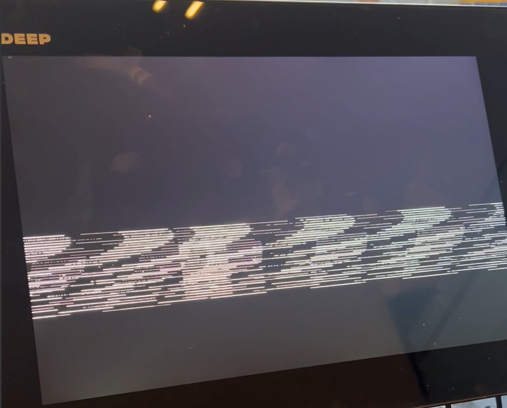

# deeprey-linux-os
Deeprey linux OS include environment (docker) and scripts for build Debian OS with minimal GUI (Xorg) environment used for running OpenCPN as kiosk application. Hardware connected with this software are: [maxtang EHL-35](docs/EHL-35.pdf) motherboard with intel CPU and [G121EAN01.2](docs/G121EAN01.2.pdf) 12.1 Inch Color TFT-LCD LVDS display panel.

## Environment
Scripts are written and tested on Debian 12 (bookworm) OS. If you use different version of Debian or other GNU/Linux distribution then scripts should be running inside virtual docker container.

### Build inside Debian 12 (bookworm)
For running script inisde Debian 12, you need to install additional packages, which are included in next command

```
apt-get install -y sed debootstrap fdisk parted syslinux dosfstools uuid-runtime extlinux syslinux-efi 
```
### Build inside docker-compose environment
Your GNU/Linux distribution must have installed `bash` and `docker-compose` application.

Wrappers for using docker environment are in `docker` folder.

To start docker environment use command `docker-compose up`

## Configuration
User configuration is in `scripts/config` file. There you can reconfigure folder paths (where will be images, rootfs and so on)

## Build
For buildig image change folder to `scripts` and then run `./build.sh`

```
cd scripts
sudo ./build.sh
```

If you use docker envirnoment then you run:
```
cd scripts
./build.sh
```
And be sure that docker container is running `docker-compose up`

## Copy image to storage
Default location of builded image is in `build/images/image.img` you can copy to storage device as `sudo dd if=build/images/image.img of=/dev/sdX bs=1M oflag=direct status=progress`

## Known HW/SW related issues

Default graphic kernel driver i915 has a bug in combination of device screen - filickering image (bookworm debian kernel version 6.1). This should be related with [this bug](https://gitlab.freedesktop.org/drm/i915/kernel/-/issues/8146), but fix from page doesn't work. Patch was also sended to i915 [developer team](https://patchwork.freedesktop.org/patch/552713/) but it was reverted.

The main simptom of issue is if picture on display is static then start flickering. If mouse are moved or there are any moving object flickering disappeared.

[](docs/flickering.mov)

Workaround is using older kernel - before 6.0. In this case we used ubuntu kernel 5.15.0-67-generic. But solution is not 100% because display start flickering when display goes from sleep state.

## Background of [./build.sh](scripts/build.sh) script

Script `./build.sh` at first check, if host is debian bookworm (12) and if user which runs script is root.

After that create guest rootfs with debootstrap (default path `build/rootfs` - you can change in `scripts/config`) where install all packages from debian repository  and copy user files from `script/files` folder. Those files are directly copied, content is not changed, script change just owner of files to "root:root", except files in `/home` folder (where are user files conected with non root owner). Those files are connected with autostart graphic interface, modules and xserver configuration.

[Workaround for flickering issue](#known-hwsw-related-issues) are in `linux-ubuntu-5.15.0-67-generic.tar.xz` file, where are Ubuntu 20.04.6 kernel (5.15.0-67-generic) and modules. This file is unpacked directly to rootfs folder. After that script rebuild initramfs.

For building image script create empty file and create block device (virtual disk storage) as loopback storage device. On block device create GPT partition, and install syslinux bootloader. Script install lagacy and EFI bootloader.

Linux kernel and initramfs are copied from rootfs into EFI partition in `linux` folder.

In the end script copy all content of rootfs folder to 2nd partition.
